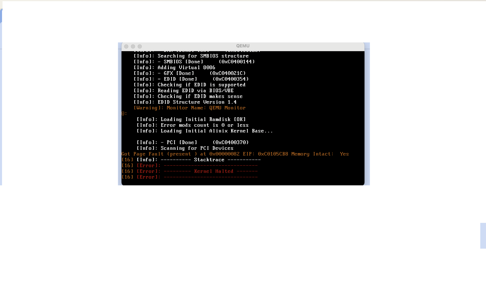
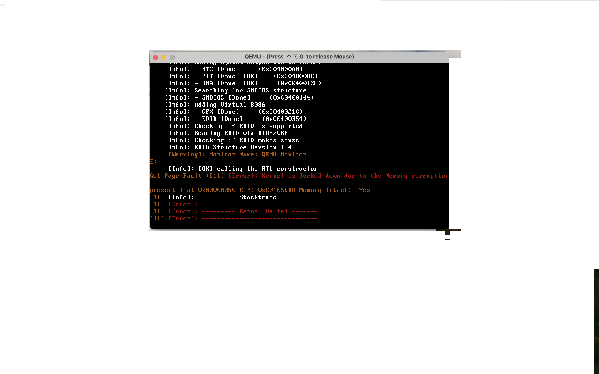

# Alinix

# Alinix kernel: Unraveling the Power of Possibilities!
# Inspirations  

By cactus os at: https://github.com/Remco123/CactusOS 


and Linux kernel at : https://github.com/torvalds/linux
# Alinix Kernel
Alinix Kernel is a sophisticated operating system kernel designed to embody the spirit of innovation and reliability in the tech industry. With a focus on efficiency and performance, this kernel represents a fusion of cutting-edge technology and meticulous design principles.


# Compilation  and Execution Environment Setup guide:
1. make sure you have  gcc, g++, make and i686-elf-gcc compiler pack installed.
3. run "make qemu" in this directory to build the kernel and run it in the virtual machine, you also get the related ISO file.
4. Enjoy and donate!!!!


# How to install

**For linux**
```
sudo apt-get install make
```

**For Macos**
```
brew install nasm
```
```
brew install i686-elf-gcc
brew install bchunk
brew install qemu
```
```
brew install make
```

**Installation**
```
make install
```

# How to run in qemu
```
qemu-system-x86_64 -kernel alinix.bin
```


# IMPORTANT
Note: this project has been using part of fudge kernel at https://github.com/jezze/fudge/blob/master/lib/hash/crc.c and other kernels at https://wiki.osdev.org/Projects and all rights will be reserved

# Screenshots


------------------------------------------------------------
**Developing image at kernel.c main file.**
------------------------------------------------------------


# Alinix kernel booting 

------------------------------------------------------------
**alinix kernel 1.5.3 booting**
------------------------------------------------------------



**alinix kernel 1.6.0 booting**
------------------------------------------------------------
