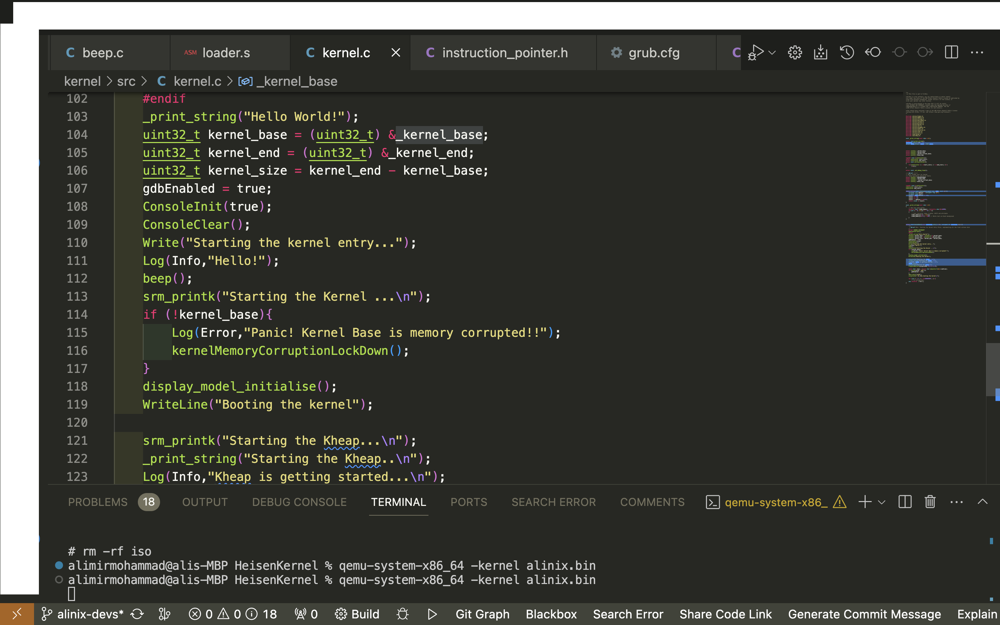

# Say My Name!!!

# Heisen Kernel: Unraveling the Power of Possibilities!
# Inspired by https://github.com/Remco123/CactusOS and Linux kernel
# HeisenKernel
HeisenKernel is a sophisticated operating system kernel designed to embody the spirit of innovation and reliability in the tech industry. With a focus on efficiency and performance, this kernel represents a fusion of cutting-edge technology and meticulous design principles.

# Compilation  and Execution Environment Setup guide:
1. make sure you have  gcc, g++, make and i686-elf-gcc compiler pack installed.
2. run "make qemu" in this directory to build the kernel and run it in the virtual machine, you also get the related ISO file.
3. Enjoy and donate!!!!

# IMPORTANT
Note: this project has been using part of fudge kernel at https://github.com/jezze/fudge/blob/master/lib/hash/crc.c and other kernels at https://wiki.osdev.org/Projects and all rights will be reserved

# Screenshots

